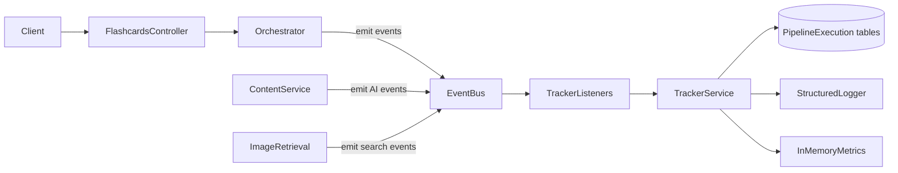

# Flashcard Pipeline Execution Tracker

## Scope and boundary

Implement the tracker described in [docs/asset-ingestion/MONITORING_PIPELINE.md](docs/asset-ingestion/MONITORING_PIPELINE.md) for the **flashcard generate workflow** (`POST /flashcards/generate`).

Do **not** redesign asset-ingestion BullMQ monitoring. Existing [src/modules/observability/](src/modules/observability/) (`PipelineMetricsService`, `StructuredLoggerService`, `GET /observability/metrics`) stays as-is for Drive→S3→AI ingestion. The new module is a separate plugin for workflow-style pipelines (flashcards first; worksheets/quizzes later via `workflowType`).



## Design decisions (locked)

- **Coupling:** Flashcard code emits Nest `EventEmitter2` events only. It never imports tracker services/repositories. Removal = unregister `PipelineTrackerModule` + drop tables/config; leftover emits are harmless with no listeners.
- **Event bus:** Add `@nestjs/event-emitter` (not present today).
- **Kill switch:** `PIPELINE_TRACKING_ENABLED=false` → module still loads but listeners no-op / skip registration; zero DB writes, metrics, or extra logs.
- **OTel / Sentry:** Neither exists in `package.json`. Ship optional adapter interfaces with no-op implementations; no hard dependency.
- **AI payloads:** Store prompt/response **hashes** by default; full payloads only when `PIPELINE_STORE_AI_PAYLOAD=true`.
- **Async safety:** Tracker persistence is fire-and-forget (`void` + catch); tracker errors never fail flashcard generation.
- **Stages:** Named constants in tracker config (not scattered magic strings). Sequence assigned by the tracker on `StageStarted`.

## Stage map for flashcard generate

Configurable catalog (initial set matching the current orchestrator in [flashcard-orchestrator.service.ts](src/modules/flashcards/services/flashcard-orchestrator.service.ts)):

| Stage key | Where emitted |
|---|---|
| `request_validation` | Orchestrator start |
| `age_identification` | After `resolveUserRequest` age parse |
| `learning_objective_selection` | After objective resolve |
| `template_selection` | Around `TemplateSelectionService.select` |
| `prompt_generation` | Start of content service (before Gemini call) |
| `llm_request` | Around Gemini `generateContent` |
| `llm_response_validation` | Around `validateLlmFlashcardPayload` |
| `image_search` | Per-card / aggregate around `retrieveForCard` |
| `image_mapping` | When attaching `assetReference` to components |
| `response_assembly` | Building final `GenerateFlashcardsResponse` |
| `response_validation` | Light structural check before return |
| `completed` / `failed` | Terminal pipeline events |

## Module layout

```text
src/modules/pipeline-tracker/
  pipeline-tracker.module.ts
  pipeline-tracker.constants.ts      # event names, stage keys, tokens
  config/pipeline-tracker.config.ts  # enabled, storeAiPayload, workflow defaults
  interfaces/pipeline-tracker.interface.ts
  events/pipeline-tracker.events.ts  # payload types
  repository/pipeline-tracker.repository.ts
  services/pipeline-tracker.service.ts
  services/pipeline-tracker-metrics.service.ts
  listeners/pipeline-tracker.listener.ts
  adapters/otel.adapter.ts           # no-op
  adapters/sentry.adapter.ts         # no-op
  controllers/pipeline-tracker.controller.ts  # debug read APIs
```

Register in [app.module.ts](src/app.module.ts) after `ObservabilityModule`. Import `EventEmitterModule.forRoot()`.

## Public emit contract (flashcards side)

Thin helper used only to emit (no tracker DI):

```ts
// src/modules/flashcards/telemetry/flashcard-pipeline.events.ts
// constants + typed emit helpers wrapping EventEmitter2
```

Flashcard services gain an optional `EventEmitter2` inject and emit at stage boundaries. No imports from `pipeline-tracker/*` except shared event **name strings** living under `src/common/events/pipeline-tracker.events.ts` so both sides share one contract without circular deps.

Interface the tracker implements internally (listeners call this):

```ts
startPipeline / completePipeline / failPipeline
startStage / completeStage / failStage / skipStage
recordAiInvocationStart / recordAiInvocationComplete
recordImageSearchStart / recordImageSearchComplete
recordEvent
```

When disabled, service methods return immediately.

## Database schema (Prisma)

Add migration alongside [prisma/schema.prisma](prisma/schema.prisma):

- **`PipelineExecution`** — `id`, `requestId`, `correlationId`, `workflowType` (`flashcards`), `currentStage`, `status`, `startedAt`, `completedAt`, `totalDurationMs`, `metadata` (Json: topic, ageGroup, templateId, count), indexes on `requestId`, `status`, `createdAt`
- **`PipelineStageExecution`** — `id`, `executionId`, `stageName`, `sequence`, `status` (`pending|running|completed|failed|skipped|cancelled`), `startedAt`, `completedAt`, `durationMs`, `retryCount`, `metadata`, FK cascade
- **`PipelineAiInvocation`** — `id`, `executionId`, `stageExecutionId?`, `provider`, `model`, `purpose`, times, `durationMs`, `retryCount`, `status`, `promptHash`, `responseHash`, token/cost fields, optional `promptPayload`/`responsePayload` Json when flag on
- **`PipelineImageSearchExecution`** — `id`, `executionId`, `stageExecutionId?`, `query`, `filters` Json, `durationMs`, `resultCount`, `selectedAssetId`, `cacheHit`, `failed`, `errorMessage?`

Do not duplicate flashcard business content (no full card JSON). Reuse patterns from existing `AiUsage` for token/cost fields but keep tables separate so tracker removal is clean.

## Configuration

Extend [src/config/configuration.ts](src/config/configuration.ts):

```env
PIPELINE_TRACKING_ENABLED=true
PIPELINE_STORE_AI_PAYLOAD=false
PIPELINE_TRACKING_WORKFLOW_DEFAULT=flashcards
```

## Emit points (minimal flashcard edits)

1. [flashcards.controller.ts](src/modules/flashcards/flashcards.controller.ts) / orchestrator — generate `requestId` + `correlationId` (from `x-trace-id` if present, else UUID); emit `PipelineStarted` / terminal complete|fail.
2. [flashcard-orchestrator.service.ts](src/modules/flashcards/services/flashcard-orchestrator.service.ts) — wrap validation, resolve, template select, assembly stages.
3. [flashcard-content.service.ts](src/modules/flashcards/services/flashcard-content.service.ts) — AI start/complete (+ hashes via SHA-256 of prompt/response text); stage fail on `INVALID_LLM_OUTPUT` / timeout.
4. [flashcard-image-retrieval.service.ts](src/modules/flashcards/services/flashcard-image-retrieval.service.ts) — search start/complete with query, filters, resultCount, selectedAssetId, duration; do not store full search hit lists.

Pass `executionId`/`requestId` through a small async context object on the generate call (parameter bag), not a global CLS dependency in v1.

## Persistence and performance

- Repository methods: create execution, upsert stage, write AI/search rows.
- Listener catches all errors, logs via `StructuredLoggerService`, swallows.
- Prefer single-row updates per stage (not chatty); batch image-search writes per card when easy.
- Never `await` tracker work on the hot path of Gemini/search beyond emitting the event (listeners use async handlers that do not block emitters).

## Metrics strategy

New in-memory `PipelineTrackerMetricsService` (same pattern as [pipeline-metrics.service.ts](src/modules/observability/pipeline-metrics.service.ts)):

- pipeline duration, per-stage duration, LLM avg, image-search avg, failure/retry counts, concurrent executions, AI call count, image search count, template usage counters

Expose under `GET /observability/pipeline-tracker/metrics` (or extend snapshot) **only when tracking enabled**. Reset on process restart (acceptable for v1; doc marks metrics as optional).

## Logging

Every tracker log line includes `execution_id`, `request_id`, `correlation_id`, `stage`, `duration_ms`, `status`, `workflow_type` via `StructuredLoggerService` — no `console.log`.

## Debug read APIs (observability only)

| Method | Path | Purpose |
|---|---|---|
| GET | `/pipeline-tracker/executions/:id` | Execution + stages + AI/search summaries |
| GET | `/pipeline-tracker/executions?requestId=` | Lookup by request id |

No mutation APIs. Disabled when tracking is off (404 or empty).

## Optional adapters

- `OtelAdapter.attachContext(executionId, correlationId)` — no-op until OTel is added
- `SentryAdapter.setContext({ executionId, stage, requestId, templateId, ageGroup, topic })` — no-op until Sentry is added

## Tests

- Unit: service no-ops when disabled; stage lifecycle transitions; listener swallows repository errors; hash helpers; event payload mapping
- Unit: flashcard emit helpers fire expected event names (mock `EventEmitter2`)
- Integration (light): enable tracking → generate with mocked LLM/search → assert `PipelineExecution` + stages persisted

## Removal checklist (document in module README comment)

1. Remove `PipelineTrackerModule` from `app.module.ts`
2. Remove env keys
3. Drop Prisma models + migrate
4. Optionally delete `src/modules/pipeline-tracker/`
5. Flashcard emit sites may remain (no listeners) or be deleted in a cleanup PR — workflow still works either way

## Out of scope

- Prometheus / Datadog exporters
- Real OpenTelemetry or Sentry packages
- Changing BullMQ ingestion tracking
- Storing full flashcard payloads or full search result sets
- Making flashcard business logic depend on tracker success
