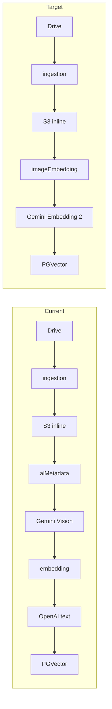

# Image Embedding Architecture Refactor

## Verdict

Replace Gemini Vision → text-embedding with **Gemini Embedding 2** (`gemini-embedding-2`): image + deterministic folder/name context → one vector in a shared space with text queries. Remove `AssetMetadata`, the `aiMetadata` queue, and OpenAI text embeddings from this pipeline.

No code changes until you approve this plan.

---

## Embedding Model Recommendation

| Candidate | Image+Text shared space | Fit | Decision |
|---|---|---|---|
| OpenAI `text-embedding-3-*` | No (text only) | Fails core requirement | Reject |
| Voyage Multimodal 3.5 | Yes | Strong quality, new vendor | Reject (extra vendor) |
| Cohere Embed v4 | Yes | Enterprise, new vendor | Reject |
| Jina v4 | Yes | Budget multimodal | Reject |
| **Gemini Embedding 2** | **Yes** (text/image/PDF/…) | Already have `GEMINI_API_KEY` + `@google/genai`; can fuse image + text in one call; GA `gemini-embedding-2` | **Adopt** |

**Chosen defaults:**
- Model: `gemini-embedding-2`
- Output dims: **1536** via `outputDimensionality` (keeps `vector(1536)`, avoids column-type migration)
- Index-time input: optimized JPEG + text `"${folderPath}\n${imageName}"` in one `embedContent` call
- Query-time input: text description only (worksheet placeholder text)
- Drop OpenAI from the embedding path (remove `OPENAI_*` usage for this feature)

Existing `text-embedding-3-small` vectors are incompatible → full re-embed / re-ingest required.

---

## Current vs Target

Runtime search stays: text query → text embedding → PGVector cosine → top-K assets.

---

## Dependency Impact Report

### Remove / stop calling
- Vision stack: [`vision-metadata.service.ts`](src/modules/ai/services/vision-metadata.service.ts), [`gemini-vision.provider.ts`](src/modules/ai/providers/gemini-vision.provider.ts), vision DTOs/parsers/mappers/`search-description.builder`
- `AssetMetadata` table and Prisma relation
- Queue `aiMetadata` + `AiMetadataMessage` + `dispatchAiMetadata`
- Asset states `GENERATING_METADATA`, `METADATA_GENERATED` (and unused `EMBEDDING_GENERATED` cleanup)
- Search metadata filters + result fields (`caption`, `colors`, `objects`, …)
- Redis asset-metadata cache keys
- `validate:vision`, Gemini vision env (`GEMINI_MODEL` / prompt version as vision-only)
- OpenAI embedding provider for this pipeline

### Modify heavily
- [`asset-pipeline.service.ts`](src/modules/pipeline/services/asset-pipeline.service.ts) — after `STORED_IN_S3` dispatch image embedding; remove metadata stage
- [`pipeline-retry.service.ts`](src/modules/pipeline/services/pipeline-retry.service.ts) — DLQ replay without `AssetMetadata.searchDescription`
- [`EmbeddingProvider`](src/common/interfaces/embedding-provider.interface.ts) — support image (+ optional text context) and text-query modes
- [`Asset`](prisma/schema.prisma) — add `folderPath`, `imageName`, `originalFilename`; drop `metadata` relation
- [`AssetEmbedding`](prisma/schema.prisma) — provider/model defaults → Gemini; rename `sourceTextHash` → `sourceHash` (hash of image content + context text)
- [`search.service.ts`](src/modules/search/search.service.ts) — new response shape; no metadata filters
- Queue topology / config / validation scripts / docs

### Preserve unchanged in behavior
- Drive scan, S3 upload, SHA-256 duplicate skip, Redis search cache pattern, PGVector cosine, SQS worker, retry/DLQ, metrics/logging, Sharp validation + AI-optimized resize (reuse for embedding input)

### Coupling risks (highest)
1. DLQ embedding replay currently requires `AssetMetadata.searchDescription`
2. Search API response + filter contract is metadata-shaped (breaking for consumers)
3. E2E harness mocks Gemini vision + text embeddings end-to-end

---

## Database Migration Plan

1. **Add** to `Asset`: `folderPath String?`, `imageName String?`, `originalFilename String?` (backfill from latest `AssetSource` where possible).
2. **Update** `AssetEmbedding` defaults: `provider=gemini`, `model=gemini-embedding-2`, keep `dimensions=1536`; rename `sourceTextHash` → `sourceHash`.
3. **Deprecate then drop** `AssetMetadata` (not shared outside this app — drop in same migration after code no longer references it; no dual-write period needed).
4. **Clear** existing `AssetEmbedding` rows (or mark assets non-COMPLETED) — old vectors are wrong model/space.
5. **Enum cleanup**: remove metadata states from Prisma `AssetState` only after code/tests no longer set them (or keep enum values deprecated one release if historical `ProcessingAttempt.stage` rows reference them — prefer keep enum values, stop using them, to avoid rewriting attempt history).

**Integrity:** Keep `Asset` ↔ `AssetSource` / `IngestionFile` / `AssetEmbedding` / `ProcessingAttempt` FKs intact.

---

## Queue / Pipeline Migration

| Today | Target |
|---|---|
| `ingestion` → (inline S3) → `aiMetadata` → `embedding` | `ingestion` → (inline S3) → `imageEmbedding` |
| `s3Upload` (DLQ-only) | Keep for `UPLOADING_TO_S3` replay |
| `AWS_SQS_AI_METADATA_QUEUE_URL` | Remove |
| `AWS_SQS_EMBEDDING_QUEUE_URL` | Repurpose as image-embedding queue (same env key or rename to `AWS_SQS_IMAGE_EMBEDDING_QUEUE_URL` and update `.env.example`) |

**Message:** `ImageEmbeddingMessage { jobId, ingestionFileId, assetId, contentHash, attempt, … }` — no `searchDescription` / `metadataVersion`.

**Stage transitions:**
`… → STORED_IN_S3 → GENERATING_EMBEDDING → COMPLETED`

**Idempotency (include in embedding stage):** if an embedding already exists for `assetId` + current model/version, skip API call and mark COMPLETED (addresses Priority-0 from [`docs/reviewtasks.md`](docs/reviewtasks.md)).

---

## Search API Breaking Changes

**Remove:** metadata filters (`orientation`, `colors`, `styles`, `objects`, `actions`, `ageGroups`, `grades`, …) and vision fields in results.

**Return:**
- `assetId`, `imageName`, `folderPath`, `s3Url` (or bucket+key as today plus constructed URL), `similarityScore`
- Keep `topK`, minimum similarity, pagination, Redis cache

Consumers of `POST /search` must update to the new DTO.

---

## Files That Will Change (grouped)

**Schema / config**
- [`prisma/schema.prisma`](prisma/schema.prisma) + new migration under `prisma/migrations/`
- [`src/config/configuration.ts`](src/config/configuration.ts), [`.env.example`](.env.example)

**AI**
- Replace vision provider with `GeminiEmbeddingProvider` implementing multimodal `EmbeddingProvider`
- Delete vision service/provider/utils/DTO/specs; update [`ai.module.ts`](src/modules/ai/ai.module.ts)
- Update [`embedding.constants.ts`](src/modules/ai/constants/embedding.constants.ts)

**Pipeline / queue**
- [`asset-pipeline.service.ts`](src/modules/pipeline/services/asset-pipeline.service.ts), [`pipeline-retry.service.ts`](src/modules/pipeline/services/pipeline-retry.service.ts), [`pipeline.constants.ts`](src/modules/pipeline/constants/pipeline.constants.ts)
- [`queue-topology.constants.ts`](src/modules/queue/queue-topology.constants.ts), [`sqs-queue.service.ts`](src/modules/queue/sqs-queue.service.ts), [`sqs-messages.interface.ts`](src/common/interfaces/sqs-messages.interface.ts)
- Observability: drop `aiMetadataLatency`, keep embedding latency

**Ingestion / asset fields**
- [`ingestion-job.service.ts`](src/modules/ingestion/ingestion-job.service.ts) — set `folderPath`, `imageName` (filename sans extension), `originalFilename` on `Asset` create/attach

**Search / cache**
- [`search.service.ts`](src/modules/search/search.service.ts), DTOs, interfaces; remove [`metadata-filter.util.ts`](src/modules/search/utils/metadata-filter.util.ts)
- Cache key util / Redis metadata cache methods

**Validation / package**
- Delete `scripts/validate/validate-vision.ts`; add `validate-image-embedding.ts`; update [`package.json`](package.json) scripts and `validate-help` / `validate-sqs` queue names

**Tests (~20 files)** — e2e harness, pipeline retry, queue, search, AI provider specs, fixtures (see audit lists)

**Docs**
- [`IMPLEMENTATION_PLAN.md`](docs/asset-ingestion/IMPLEMENTATION_PLAN.md), [`HANDOFF_CONTEXT.md`](docs/asset-ingestion/HANDOFF_CONTEXT.md), [`COMPONENT_VALIDATION_REPORT.md`](docs/asset-ingestion/COMPONENT_VALIDATION_REPORT.md), diagrams referenced there

---

## Incremental Execution Order (after approval)

Execute one task at a time; keep build + tests green after each.

1. **Schema + Asset fields** — migration for `folderPath`/`imageName`/`originalFilename`; populate on create; keep `AssetMetadata` temporarily
2. **Multimodal embedding provider** — Gemini Embedding 2; extend interface; unit tests; `validate:image-embedding`
3. **Queue refactor** — remove `aiMetadata`; wire `imageEmbedding` message/dispatch; update worker topology + retry/DLQ
4. **Pipeline stage** — S3 → image embed → store vector → COMPLETED; idempotent skip; remove vision stage calls
5. **Drop AssetMetadata + OpenAI embedding path** — schema drop, delete vision modules, clean config
6. **Search API** — new response/filters; update cache; specs + e2e
7. **Validation scripts + docs** — replace vision validate; update handoff/plan/report/diagrams
8. **Full suite** — `npm test`, `npm run test:e2e`, `npm run build`

---

## Breaking Changes Summary

- Search response/filter contract changes
- `AssetMetadata` gone; no AI captions/keywords
- Embedding vectors invalid until re-ingest
- Env: remove AI metadata queue + Gemini vision model/prompt; add/repurpose embedding model config (`GEMINI_EMBEDDING_MODEL`); remove OpenAI embedding dependency for this feature
- Asset states metadata stages unused (historical attempts may still show them)
- AWS: delete or ignore `aiMetadata` SQS queue in infra

---

## Out of Scope (this refactor)

- Pilot Drive migration (TASK-020)
- HNSW index enablement
- DLQ replay auth hardening
- Non-embedding items from `reviewtasks.md` (double Drive download, etc.) except embedding-stage idempotency
